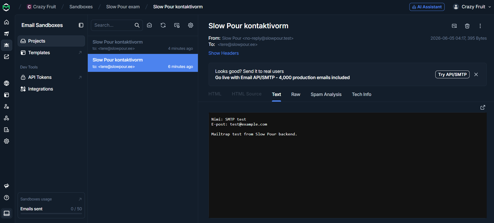

# Mailtrapi test

Kontaktivormi saatmist kontrollisin Mailtrapi sandboxiga 5. juunil 2026.
Rakendus võttis `POST /kontakt` vormi vastu ja Nodemailer saatis kirja SMTP
kaudu Mailtrapi testpostkasti.



Ekraanipildil on näha:

- kirja pealkiri `Slow Pour kontaktivorm`
- saatja `Slow Pour <no-reply@slowpour.test>`
- saaja `tere@slowpour.ee`
- vormilt saadetud nimi, e-post ja sõnum

Testis kasutatud muutujate kuju:

```env
SMTP_HOST=sandbox.smtp.mailtrap.io
SMTP_PORT=587
SMTP_SECURE=false
SMTP_USER=...
SMTP_PASS=...
CONTACT_TO=tere@slowpour.ee
CONTACT_FROM="Slow Pour <no-reply@slowpour.test>"
```

Kasutajanimi ja parool asuvad ainult lokaalses `.env` failis või serveri
keskkonnamuutujates. Neid ei ole repos ega ekraanipildil.
